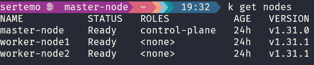

# Crear un Cluster de Kubernetes Casero


Repo para documentar las etapas de la creación de un cluster kubernetes en 3 [Beelinks S12Pro](https://www.amazon.es/dp/B07RNKFJHT?ref=ppx_yo2ov_dt_b_fed_asin_title)

## 1- Sistema Operativo

- Instalar **Ubuntu Server** en los 3 beelink
- Habilitar el reinicio automático tras **PowerOff** de los beelink en la BIOS:
    - F7
    - Setup
    - Advanced setup
    - Cambiar a **State S5**
- Opcionalmente instalar **Starship** para tener un prompt personalizado. [Doc](https://starship.rs/guide/)
```sh
curl -sS https://starship.rs/install.sh | sh
```

## 2- Configuración de red

Es conveniente tener una **ip privada fija** en cada equipo. Para ello hay que seguir los siguientes pasos en **todos los nodos**.

### 2.1- Deshabilitar la configuración de red de cloud-init para hacer cambios permanentes

```sh
sudo mkdir -p /etc/cloud/cloud.cfg.d
sudo nano /etc/cloud/cloud.cfg.d/99-disable-network-config.cfg
```

Añadir la linea:
```yaml
network: {config: disabled}
```

- Fijar ips en todos los nodos con **netplan**
```sh
sudo nano /etc/netplan/50-cloud-init.yaml
```

Modificar el archivo. A cada nodo asignarle una IP privada diferente
```yaml
network:
  version: 2
  ethernets:
    enp1s0:  # Asegurarse de que el ni se llama asi
      dhcp4: no
      addresses:
        - 192.168.1.34/24  # IP para la interfaz ethernet
      routes:
        - to: default
          via: 192.168.1.1
          metric: 100  # Prioridad Número mas bajo, mayor prioridad
      nameservers:
        addresses:
          - 80.58.61.250
          - 80.58.61.254
  wifis:
    wlo1:
      dhcp4: no
      addresses:
        - 192.168.1.33/24  # IP para la interfaz wifi
      routes:
        - to: default
          via: 192.168.1.1
          metric: 200
      access-points:
        "InharTxu":
          password: "*El*****GO@**"  # Contraseña del wifi
      nameservers:
        addresses:
          - 80.58.61.250
          - 80.58.61.254
```
### 2.2- Abrir puertos

Utilizando `ufw` abrir los siguientes puertos en el **master-node**:
- **51820/udp** Para usar **WireGuard VPN**, no es imprescindible usar WireGuard
- **6443**
- **443**
- **80**
- **8443** Para **ingress-nginx** que da acceso al cluster desde internet
- **10250/tcp** Para los kubelet y **logs**
- **22/tcp** Para poder usar **ssh**
- **179/tcp** Para BGP

En los **worker-node** abrir todos los puertos indicados anteriormente excepto el de **WireGuard**, que no es necesario.

Verificar estado del firewall
```sh
sudo ufw status
```

### 3- WireGuard VPN

Opcionalmente se puede instalar [WireGuard](https://www.wireguard.com/quickstart/) para crear un tunel desde cualquier red a la red local y poder acceder asi a través de IP privada a todos los nodos.

Para ello mi ordenador portatil hace de cliente descargando WireGuard para [windows](https://www.wireguard.com/install/).
En el cliente hay que crear una interfaz con clave privada y direccion IP privada y un peer que será el nodo maestro especificando Publickey del nodo maestro, AllowedIPs, Endpoints. Se peude generar un archivo que se carga en la UI

```ini
[Interface]
PrivateKey = <clave privada del cliente>
Address = 10.0.0.2/24

[Peer]
PublicKey = <clave publica del mater-node>
AllowedIPs = 10.0.0.0/24
Endpoint = <mi dominio o ip publica de mi red>:51820
PersistentKeepalive = 25
```

En los worker-node crear una interfaz con el master-node de manera similar. Configurar el archivo `/etc/wireguard/wg0.conf`

```ini
[Interface]
PrivateKey = <clave privada worker node1>
Address = 10.0.0.4/24

[Peer]
PublicKey = <clave publica del master-node>
AllowedIPs = 10.0.0.0/24
Endpoint = <mi dominio o ip publica de mi red>:51820
PersistentKeepalive = 25
```

La conexión a la red privada se hará a través del master-node. La configuración del master-node tiene que recoger todos los peer en el archivo `wg0.conf`. Por ejemplo:

```ini
[Interface]
Address = 10.0.0.1/24   # IP para el servidor WireGuard (master-node)
ListenPort = 51820       # Puerto para WireGuard
PrivateKey = <clave privada master-node>

PostUp = iptables -A FORWARD -i wg0 -j ACCEPT; iptables -t nat -A POSTROUTING -o eth0 -j MASQUERADE
PostDown = iptables -D FORWARD -i wg0 -j ACCEPT; iptables -t nat -D POSTROUTING -o eth0 -j MASQUERADE

[Peer]
PublicKey = <clave publica del cliente>
AllowedIPs = 10.0.0.2/32  # Ip del cliente

[Peer]
PublicKey = <clave publica del worker-node 1>
AllowedIPs = 10.0.0.3/32  # Ip del worker-node 1

[Peer]
# ...
```
Es importante ejecutar el servicio en cada nodo para asegurarse de que corra y se reinicie siempre:
```bash
sudo systemctl enable wg-quick@wg0
```

Si hay algún problema probar a hacer un `restart` del servicio.

```bash
sudo systemctl restart wg-quick@wg0
```

Para ver si todo funciona correctamente, ejecutar el siguiente comando en el **nodo master**:
```bash
sudo wg
```

Deberían verse todos los peers y los handshakes realizados
```
interface: wg0
  public key: KKoTamH4RtqGc5yT8yHVUYVVRZ9WfUI1C8Sotl4PEBc=
  private key: (hidden)
  listening port: 51820

peer: lE0bLnclDtm+jJRmOZHyFqfdN0/agVyTlS29qTt3ujc=
  endpoint: 192.168.1.1:52763
  allowed ips: 10.0.0.3/32
  latest handshake: 10 seconds ago
  transfer: 180 B received, 92 B sent

peer: D20Lhynl5WuofqK4CdK/QXDAynKYuzL7d27o4fZZ0w0=
  endpoint: 192.168.1.1:65042
  allowed ips: 10.0.0.2/32
  latest handshake: 37 seconds ago
  transfer: 87.80 KiB received, 100.79 KiB sent

peer: tQPSZsGQL68jljMtiKRUHlAFy+v+dB3Hc1aBcwwleT0=
  endpoint: 192.168.1.1:37449
  allowed ips: 10.0.0.4/32
  latest handshake: 45 seconds ago
  transfer: 1.17 KiB received, 368 B sent
```

Una vez configurado correctamente todo, desde el cliente se puede Activar la VPN y entrar en cada uno de los nodos usando las ips privadas asignadas.


## 4- Runtime

Para poder crear los contenedores dentro del cluster hace falta un *container runtime*. En este caso descargaremos [containerd](https://github.com/containerd/containerd/blob/main/docs/getting-started.md) que está soportado por Kubernetes. **Docker** ya no está soportado por Kubernetes.

En todos los nodos ejecutar:
```sh
sudo apt-get install -y ca-certificates curl gnupg lsb-release
```

```sh
sudo mkdir -p /etc/apt/keyrings
curl -fsSL https://download.docker.com/linux/ubuntu/gpg | \
  sudo gpg --dearmor -o /etc/apt/keyrings/docker.gpg

```

```sh
echo \
  "deb [arch=$(dpkg --print-architecture) signed-by=/etc/apt/keyrings/docker.gpg] \
  https://download.docker.com/linux/ubuntu \
  $(lsb_release -cs) stable" | \
  sudo tee /etc/apt/sources.list.d/docker.list > /dev/null
```

```sh
sudo apt-get update
sudo apt-get install -y containerd.io
```

### 4.1- cgroup (administrador de recursos RAM etc)

También hace falta un administrador y gestor de los recursos de los contenedores como RAM, CPU etc.
```sh
sudo mkdir -p /etc/containerd
sudo containerd config default | sudo tee /etc/containerd/config.toml
```

```sh
sudo nano /etc/containerd/config.toml
```

Buscar en la sección y cambiar a true
```toml
[plugins."io.containerd.grpc.v1.cri".containerd.runtimes.runc.options]
  SystemdCgroup = true
```

```sh
sudo systemctl restart containerd
sudo systemctl enable containerd
```

## 5- Deshabilitar swap

Kubernetes se bloquea si se accede a la memoria swap y por lo tanto recomiendan deshabilitarla.

En todos los nodos hay que editar el archivo `/etc/fstab` y comentar la línea que contiene la partición de **swap**.

## 6- Configurar los parámetros del kernel

En todos los nodos ejecutar los siguientes comandos
```sh
sudo modprobe overlay
sudo modprobe br_netfilter
```

```sh
sudo tee /etc/sysctl.d/99-kubernetes-cri.conf <<EOF
net.bridge.bridge-nf-call-iptables  = 1
net.ipv4.ip_forward                 = 1
net.bridge.bridge-nf-call-ip6tables = 1
EOF

sudo sysctl --system
```

## 7- Instalar kubeadm kubectl kubelet

[doc](https://kubernetes.io/docs/setup/production-environment/tools/kubeadm/install-kubeadm/)
En todos los nodos hay que instalar las herramientas de administración del cluster.

```sh
sudo apt-get update
# apt-transport-https may be a dummy package; if so, you can skip that package
sudo apt-get install -y apt-transport-https ca-certificates curl gpg
```

```sh
# If the directory `/etc/apt/keyrings` does not exist, it should be created before the curl command, read the note below.
# sudo mkdir -p -m 755 /etc/apt/keyrings
curl -fsSL https://pkgs.k8s.io/core:/stable:/v1.31/deb/Release.key | sudo gpg --dearmor -o /etc/apt/keyrings/kubernetes-apt-keyring.gpg
```

```sh
# This overwrites any existing configuration in /etc/apt/sources.list.d/kubernetes.list
echo 'deb [signed-by=/etc/apt/keyrings/kubernetes-apt-keyring.gpg] https://pkgs.k8s.io/core:/stable:/v1.31/deb/ /' | sudo tee /etc/apt/sources.list.d/kubernetes.list
```

```sh
sudo apt-get update
sudo apt-get install -y kubelet kubeadm kubectl
sudo apt-mark hold kubelet kubeadm kubectl
```

```sh
sudo systemctl enable --now kubelet
```

## 8- Iniciar el Cluster

Vamos a usar [Flannel](https://github.com/flannel-io/flannel) como **CNI**. Proporciona redes de capa 3 entre nodos. Kubernetes por sí solo no gestiona la red entre los diferentes pods y nodos, por lo que necesita un complemento de red (plug in) para garantizar que los pods puedan comunicarse entre sí, incluso cuando se ejecutan en diferentes nodos. Flannel es uno de los complementos de red más populares para este propósito. En el **nodo maestro**

```sh
sudo kubeadm init --pod-network-cidr=10.244.0.0/16  # Rango para flannel
```

**IMPORTANTE**: Una vez inicializado correctamente, anotar el comando que devuelve para poder juntar nodos. Por ejemplo:

```sh
sudo kubeadm join 192.168.1.34:6443 --token ggvwi4.6k2********tt1a58 \
        --discovery-token-ca-cert-hash sha256:159872e0385********f752cc19822b4dc7060156b226*********
```

**Nota**: El parámetro --pod-network-cidr debe coincidir con la red que utilizará tu plugin de red (en este ejemplo, **Flannel**)

### 8.1 - Configurar el archivo admin.conf

Para usar **kubectl**, debemos configurar `admin.conf`. Para ello en el **nodo maestro** ejecutamos:

```sh
mkdir -p $HOME/.kube
sudo cp -i /etc/kubernetes/admin.conf $HOME/.kube/config
sudo chown $(id -u):$(id -g) $HOME/.kube/config
```

## 9 - Unir los nodos trabajadores

En cada **worker-node**
```sh
sudo kubeadm join 192.168.1.34:6443 --token ggvwi4.******** \
        --discovery-token-ca-cert-hash sha256:<hash>
```

## 10 - Instalar plugin de red

En el **nodo maestro** se usa Flannel como plugin de red o CNI (lo intenté con Calico pero me daba errores). Se puede instalar con **Helm** o con un manifiesto:

```sh
kubectl apply -f https://github.com/flannel-io/flannel/releases/latest/download/kube-flannel.yml
```

Hay que instalar plugins en `/opt/cni/bin`. Deben aparecer:
```
bandwidth  bridge  dhcp  dummy  firewall  flannel  host-device  host-local  ipvlan  loopback  macvlan  portmap  ptp  sbr  static  tuning  vlan  vrf
```

 Para ello los descargamos y los instalamos:
```sh
curl -L https://github.com/containernetworking/plugins/releases/download/v1.2.0/cni-plugins-linux-amd64-v1.2.0.tgz | sudo tar -C /opt/cni/bin -xz
```

Verificar que todos los plugins esten instalados
```sh
ls /opt/cni/bin
```

Reiniciar **kubelet**
```sh
sudo systemctl restart kubelet
```

Después de estos pasos debería estar bien configurado el cluster. Todos los nodos deberían estar en estado **READY**.

Comprobarlo:
```sh
kubectl get nodes
```


Si los pods de **coredns** no están en Running verificar que estan todos los plugins de flannel en 


Verificar que todos los pods estén en **Running**

```sh
kubectl get pods -n kube-system
k get pods -n kube-flannel # (con alias k=kubectl)
```

Verificar la conectividad con API server del **master node**.

En el nodo maestro, podemos ver la IP del API server de la siguiente manera (control-plane)
```sh
kubectl cluster-info
```

Crear un nodo simple y meterse en él para llamar a la API
```sh
kubectl run -it --rm --image=busybox debug --restart=Never -- /bin/sh
```

## 11- Troubleshouting

Si hay problemas con la autenticación **TLS** entre nodos o entre componentes del cluster, renovar los certificados:
```sh
sudo kubeadm certs renew all
```

Después de renovar certificados, reiniciar componentes clave del cluster:
```sh
kubectl rollout restart pod kube-apiserver -n kube-system
kubectl rollout restart pod etcd -n kube-system
```

Si hay problemas con un pod o un servicio específico, obtener información con el siguiente comando:
```sh
kubectl describe pod <pod-name> -n <namespace>

```

## 12- Crear Volúmenes en local path

### 12.1- StorageClass

Para poder crear volúmenes y archivos persistentes dentro del cluster de forma dinámica es necesario primero crear una **StorageClass** que llamamos `local-path`. Define cómo y donde se deben almacenar los volúmenes persistentes.

Para ello aplicamos el siguiente archivo:
```yaml
apiVersion: storage.k8s.io/v1
kind: StorageClass
metadata:
  name: local-path
provisioner: rancher.io/local-path
reclaimPolicy: Delete  # Indica qué hacer con la data cuando el volumen se elimina
volumeBindingMode: Immediate
```

### 12.2- Controlador local-path-storage

El controlador es responsable de gestionar los volúmenes locales en los nodos del cluster. Aprovisiona dinámicamente dichos volúmenes en el entorno local.

```sh
kubectl apply -f https://raw.githubusercontent.com/rancher/local-path-provisioner/master/deploy/local-path-storage.yaml
```

### 12.3- Crear PVC

Ahora, en el entorno de cualquier aplicación, puede crearse un **PersistenVolumeClaim** (PVC) para solicitar al StorageClass un determinado espacio.
Por ejemplo:

```yaml
apiVersion: v1
kind: PersistentVolumeClaim
metadata:
  name: dynamic-pv
spec:
  accessModes:
    - ReadWriteOnce
  resources:
    requests:
      storage: 100Mi  # Cuanto espacio se solicita
  storageClassName: local-path  # Nombre del storageclass creado anteriormente
```

### 12.4- Verificar que está bound

Si el aprovisionamiento dinámico está funcionando correctamente, el PVC debería aparecer como `Bound`, indicando que se ha aprovisionado un volumen correctamente.

```sh
kubectl get pvc
```

### 12.5- Crear Deployment que use PVC

Un Deployment puede montar el volumen solicitado por el PVC para almacenar datos persistentes.

```yaml
apiVersion: apps/v1
kind: Deployment
metadata:
  name: nginx-deployment
spec:
  replicas: 3
  selector:
    matchLabels:
      app: nginx
  template:
    metadata:
      labels:
        app: nginx
    spec:
      containers:
        - name: nginx
          image: nginx:1.26.0
          volumeMounts:
            - name: data
              mountPath: /some/mount/path  # Ruta dentro de los contenedores de este deployment que será persistente
      volumes:
        - name: data
          persistentVolumeClaim:
            claimName: dynamic-pv  # Nombre del PVC creado
```

### 12.6- Verificar que la información persiste

Entramos en un pod
```sh
kubectl exec -it nginx-deployment-<pod-id> -- /bin/sh
```
Escribimos en la ruta persistente definida en el deployment
```sh
cd /some/mount/path
echo "Data persistente" > test.txt
```

Eliminado el pod
```sh
kubectl delete pod <nombre-del-pod>
```

El pod se habrá vuelto a crear de nuevo, entramos en el nuevo pod y verificamos el archivo
```sh
kubectl exec -it <nuevo-nombre-del-pod> -- /bin/sh
ls /some/mount/path
cat /some/mount/path/test.txt
```

# 13- Conectarse al cluster a través de VPN tunel WireGuard

Para poder conectarse al cluster a través de una VPN con WireGuard hay que agregar la ip del master node que le asigna WireGuard a la lista de certificados de kubeadm sino fallará la verificación tls.

Podemos descargar el yaml en local con el siguiente comando tras hacer **ssh en el master node**:

```sh 
kubectl -n kube-system get configmap kubeadm-config -o jsonpath='{.data.ClusterConfiguration}' > kubeadm.yaml
```

Y editarlo agregando al apartado `certSANs` la ip del master node asignada por WireGuard

```yaml
apiServer:
  certSANs:
    - "192.168.1.34"
    - "10.96.0.1"
    - "10.0.0.1"  # Agregada IP del master node aquí
apiVersion: kubeadm.k8s.io/v1beta4
caCertificateValidityPeriod: 87600h0m0s
certificateValidityPeriod: 8760h0m0s
certificatesDir: /etc/kubernetes/pki
clusterName: kubernetes
controllerManager: {}
dns: {}
encryptionAlgorithm: RSA-2048
etcd:
  local:
    dataDir: /var/lib/etcd
imageRepository: registry.k8s.io
kind: ClusterConfiguration
kubernetesVersion: v1.31.0
networking:
  dnsDomain: cluster.local
  podSubnet: 10.244.0.0/16
  serviceSubnet: 10.96.0.0/12
proxy: {}
scheduler: {}
```

Después, mover los certificados para que kubeadm cree unos nuevos. Aqui los movemos a la carpeta del usuario

```sh
mv /etc/kubernetes/pki/apiserver.{crt,key} ~
```

Regeneramos nuevos certificados usando el yaml modificado

```sh
kubeadm init phase certs apiserver --config kubeadm.yaml
```

Después es necesario reiniciar el pod de `kube-apiserver-master-node` que se encuentra en el namespace  `kube-system`

```sh
k get pods -n kube-system
```

Borramos el pod para que se vuelva a generar

```sh
k delete pod -n kube-system kube-apiserver-master-node
```

Tras esto ya deberíamos ser capaces de conectarnos al cluster con la VPN de WireGuard activada sin necesidad de hacer ssh al master node.

# 14- Pasos para dar acceso al cluster a un amigo

## 14.1- Instalar kubectl
El amigo tendrá que instalar `kubectl` en su máquina en función de su sistema operativo.

## 14.2- Configurar tunel VPN con WireGuard
El amigo tendrá que instalar también WireGuard en su sistema y configurarlo.

Para la configuración es necesario intercambiar claves públicas / privadas

En la máquina del amigo puede generarse un par de claves:

```sh
wg genkey | tee privatekey | wg pubkey > publickey
```

La clave pública será para el master node y la privada deberá guardarse en la configuración de WireGuard

Agregar un nuevo peer en el archivo `/etc/wireguard/wg0.conf` en el **master-node**.

```ini
[Peer]
PublicKey = <clave_publica_amigo>
AllowedIPs = 10.0.0.5/32  # IP asignada a su máquina
```

En la máquina del amigo agregar como peer el master-node al archivo de configuración de WireGuard:

```ini
[Interface]
PrivateKey = <clave_privada_de_tu_amigo>
Address = 10.0.0.5/24  # IP asignada a su máquina dentro de la VPN

[Peer]
PublicKey = <clave_publica_del_master-node>
AllowedIPs = 10.0.0.0/24  # Rango de IPs de la red privada del clúster
Endpoint = trymlmodels.com:51820
PersistentKeepalive = 25
```

Reiniciar el servicio WireGuard en el master node:

```bash
sudo systemctl restart wg-quick@wg0
```

Tras esto hay que activar WireGuard en la máquina del amigo. En Windows se hace a través de la interfaz gráfica:


Verificar que los handshakes se realizan correctamente.

## 14.3- Archivo kubeconfig

Para poder interactuar con el cluster, el amigo necesitará el archivo `~/.kube/config` de mi cluster.

Se puede copiar mediante scp:

```sh
scp user@master-node:~/.kube/config ~/.kube/config
```

Editar el archivo y asegurarse de que está la ip interna de la VPN del master node

```yaml
clusters:
- cluster:
    certificate-authority-data: ...
    server: https://10.0.0.1:6443  # ip asignada al master node en la VPN
  name: kubernetes
```

## 14.4- Exportar KUBECONFIG

En la máquina del amigo exportar la variable KUBECONFIG para que apunte al archivo de configuración

```sh
export KUBECONFIG=~/.kube/config
```

Para que el cambio sea permanente puede agregarse a `.bash_profile` o  `.bashrc` en caso de usar la terminal bash.

## 14.5- Verificar la conexión

Una vez realizado los pasos anteriores, el amigo ya debería ser capaz de conectarse al clúster

```sh
kubectl get nodes -owide
```

## 15- Monitoring

Vamos a instalar **Prometheus** en el cluster como sistema de monitoreo. Seguiremos las indicaciones de esta [página web](https://medium.com/@akilblanchard09/monitoring-a-kubernetes-cluster-using-prometheus-and-grafana-8e0f21805ea9)


Para visualizar en el navegador Prometheus:

```sh
kubectl port-forward -n monitoring svc/prometheus-server 9090:80
```

Y estará disponible en http://localhost:9090

Para visualizar Grafana:

```sh
kubectl port-forward -n monitoring svc/grafana 3000:80
```

Y estará disponible en http://localhost:3000. 
El usuario es `admin` y la contraseña es la key que se genera ejecutando el comando que viene en el txt.

## 16 - Persistent storage con PostgresSQL
Otra opción para almacenar datos es tener en el cluster una base de datos corriendo como servicio en un pod.

La manera más fácil de instalar es mediante **Helm**. Para ello primero añadir el repositorio bitnami:

```sh
helm repo add bitnami https://charts.bitnami.com/bitnami
helm repo update
```

Podemos añadir postgres a un namespace dedicado para él o a uno donde vayamos a usarlo con un proyecto. Para crear un namespace por ejemplo llamado database crear el siguiente yaml:

```yaml
apiVersion: v1
kind: Namespace
metadata:
  name: databases
```

Y después crearlo con el comando:

```sh
k apply -f Namespace.yaml
```

**Nota**: Hay que crear el Namespace antes de instalar postgres en el namespace.

Para instalar postgres con helm podemos configurar algunos valores creando primero un `values.yaml`:

```yaml
global:
  postgresql:
    postgresqlUsername: admin
    postgresqlPassword: adminpassword
    postgresqlDatabase: mydatabase

primary:
  persistence:
    enabled: true
    size: 10Gi
    storageClass: local-path  # Si usas local-path para almacenamiento
```

Después instalar el deployment con helm
```sh
helm install my-postgres bitnami/postgresql --namespace <your-namespace> -f values.yaml
```

Para acceder a la base de datos mediante código Python es importante tener en cuenta que:

- Usando **sqlalchemy** la URL será la siguiente: DATABASE_URL = "**postgresql://postgres:<your_password>@my-postgres-postgresql.database.svc.cluster.local:5432/postgres**" (Hay que especificar la ruta completa en el hostname)

Como postgres fue configurado mediante Helm, ya ha creado un **PVC** y por tanto no hay que definirlo. Se puede comprobar con:

```sh
k get pvc -n database
```

Para montar ahora una aplicación en Python que use l base de datos recién creada será necesario establecer el `Deployment.yaml`, por ejemplo:

```yaml
apiVersion: apps/v1
kind: Deployment
metadata:
  name: webapp
  namespace: webapp  # Namespace de la aplicación
spec:
  replicas: 2
  selector:
    matchLabels:
      app: webapp
  template:
    metadata:
      labels:
        app: webapp
    spec:
      containers:
        - name: webapp
          image: sertemo/webapp-flask:latest  # nombre de la imagen del contenedor de la aplicación
          ports:
            - containerPort: 5000
          env:
            - name: POSTGRES_HOST
              value: "my-postgres-postgresql.database.svc.cluster.local" # Dirección del servicio de PostgreSQL
            - name: POSTGRES_DB
              value: "postgres"
            - name: POSTGRES_USER
              valueFrom:
                secretKeyRef:
                  name: my-postgres-postgresql
                  key: postgres-user
            - name: POSTGRES_PASSWORD
              valueFrom:
                secretKeyRef:
                  name: my-postgres-postgresql
                  key: postgres-password

```

Los valores de user y password se cogen de un secret:

```yaml
apiVersion: v1
kind: Secret
metadata:
  name: my-postgres-postgresql
  namespace: database
type: Opaque
data:
  postgres-user: dXNlcm5hbWU=    # valor en base64, por ejemplo, 'username'
  postgres-password: cGFzc3dvcmQ= # valor en base64, por ejemplo, 'password'
```

Creamos el service asociado a la aplicación

```yaml
apiVersion: v1
kind: Service
metadata:
  name: webapp-service
  namespace: webapp
spec:
  ports:
    - port: 5000
      targetPort: 5000
  selector:
    app: webapp
```


Para exponerla a internet podemos crear un Ingress

```yaml
apiVersion: networking.k8s.io/v1
kind: Ingress
metadata:
  name: webapp-ingress
  namespace: webapp
  annotations:
    nginx.ingress.kubernetes.io/rewrite-target: /
spec:
  rules:
    - host: webapp.example.com
      http:
        paths:
          - path: /
            pathType: Prefix
            backend:
              service:
                name: webapp-service
                port:
                  number: 5000
```

